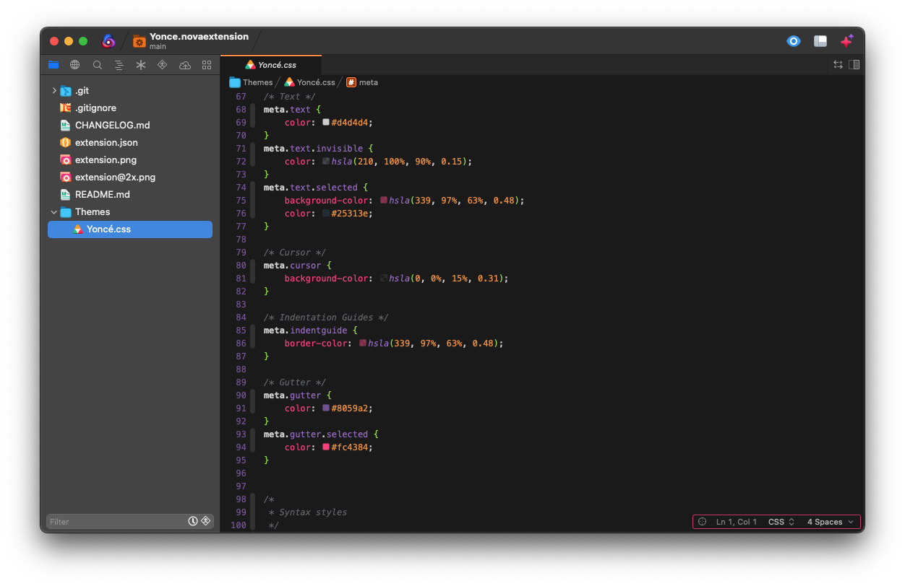

# Yoncé for Nova

**Yoncé** is a Queen Bey inspired theme for Nova.

## Instructions

1. Go to **Extensions ➞ Extensions Library**. Choose the **Themes** tab and install the theme from here.
1. Go to **Nova ➞ Preferences**. Choose the **Theme** tab and choose **Yoncé** to activate the theme.

## Bug reports

If you find any issues with this theme, bug reports and/or pull requests are welcome.

## Acknowledgements

Yoncé for Nova is based on [Yoncé](https://github.com/minamarkham/yonce) by Mina Markham.
